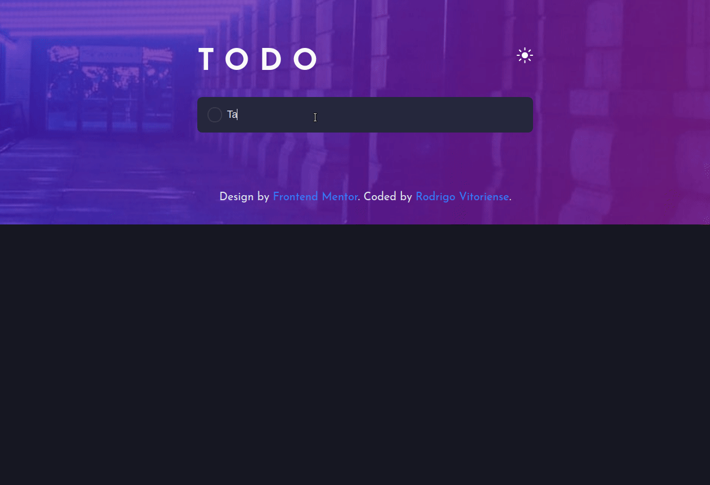

<h1 align="center">
    TODO APP
</h1>

 <a href="#📷-demonstração">Demonstração</a> •
 <a href="#ℹ️-sobre">Sobre</a> • 
 <a href="#🔗-links">Links</a> • 
 <a href="#🛠-tecnologias">Tecnologias</a> • 
 <a href="#📚-aprendizado">Aprendizado</a> • 
 <a href="#👨‍💻-autor">Autor</a> • 
 <a href="#👏-agradecimentos">Agradecimentos</a> 

 

# 📷 Demonstração

  

# ℹ️ Sobre

Esta é uma solução para uma lista de tarefas. Neste projeto, os usuários devem ser capazes de:

- Ver o tamanho dos elementos ajustados com base no tamanho da tela de seus dispositivos;
- Realizar as operações de adicionar ou remover uma tarefa;
- Ajustar o tema de cores com base em sua preferência.
    

# 🔗 Links

- URL da solução: [Todo App]()
    

# 🛠 Tecnologias

As seguintes tecnologias foram utilizadas na construção do projeto:

- [HTML5](https://developer.mozilla.org/en-US/docs/Glossary/HTML5)
- [CSS3](https://developer.mozilla.org/pt-BR/docs/Web/CSS)
- [JavaScript](https://developer.mozilla.org/pt-BR/docs/Web/JavaScript)
- [Flexbox](https://developer.mozilla.org/pt-BR/docs/Web/CSS/CSS_Flexible_Box_Layout/Basic_Concepts_of_Flexbox)
    

# 📚 Aprendizado

Neste projeto, tive como principais aprendizados a utilização dos seguintes recursos:

- criação do seletor de temas;
- uso da propriedade [HTMLElement.dataset](https://developer.mozilla.org/pt-BR/docs/Web/API/HTMLOrForeignElement/dataset) ;
- utilização do localStorage;
- reutilização de código.
    

# 👨‍💻 Autor

- [Linkedin](https://www.linkedin.com/in/rodrigovitoriense/)
- [GitHub](https://github.com/rodrigorvix)
    

# 👏 Agradecimentos

Agradeço aos excelentes professores da Let's Code (https://letscode.com.br/) por compartilhar o conhecimento necessário para a realização do projeto e ao Frontend Mentor (https://www.frontendmentor.io/) por disponibilizar o design para o desafio.
